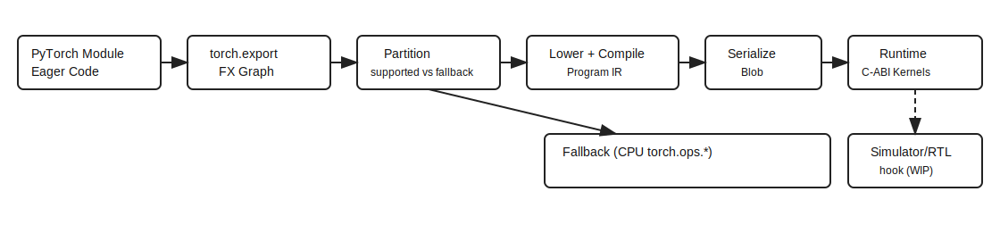

# PyTorch Export Backend Demo
## Setup
```bash
conda create -n accel_project python=3.11 -y
conda activate accel_project
pip install -r requirements.txt
python -c "import torch; print(torch.__version__); print(torch.cuda.is_available())"
```

## Run the demos

```bash
python export_basics.py
python explore_fx_graph.py
python my_accel_backend_prototype.py
python backend_pipeline_demo.py
```
## Diagram



Scratchpad allocation is modeled as a runtime firmware service (not a compile‑time decision).

## Current stack

1. **Graph capture**: `torch.export.export` produces an FX `GraphModule`.
2. **Lowering**: the backend maps ATen ops to Atalla kernel stubs.
3. **Compilation**: the graph is lowered into a linear program.
4. **Serialization**: the program is encoded into a byte blob.
5. **Runtime**: the blob is placed in simulated DRAM and executed via a C‑ABI shim into `kernel_lib`.
6. **Fallback**: unsupported ops can call back into `torch.ops.*`.

Notes:
- scripts are device-agnostic by default.
- `my_accel_backend_prototype.py` routes ops through `kernel_lib.py` (Python
  placeholder kernels).
- `backend_pipeline_demo.py` adds partitioning + serialization + C-ABI boundary.
- `torch.export` is used to capture graphs for the demo backend pipeline.
 - Exported graphs use ATen ops like `aten.relu.default`, which is what the
   registry maps against.
- No `torch.compile`/JIT: we use static export so the compiler can emit a fixed
  blob that the simulator can load from DRAM.

## Output

`export_basics.py`
- Example 1 prints an output shape like `torch.Size([128, 128])`
- Example 2 prints a graph summary (node list + tabular + generated code with ATen ops), then an output shape like `torch.Size([32, 64])`
- Example 3 prints the exported ops table (ATen targets) and a numeric output sum

`explore_fx_graph.py`
- Prints the FX graph table
- Prints each node with `op`, `target`, `args`, `kwargs`
- Prints the generated forward code

`my_accel_backend_prototype.py`
- Prints the ops seen by the backend (supported vs fallback)
- Prints a compile step (`Compiling graph -> ...`, `Program length: ...`)
- Shows `EXECUTING ON MY_ACCEL` and per-op logs
- Prints final output shape and output sums for two calls
- Kernel calls go through `kernel_lib.py` (GEMM/ReLU/Softmax placeholders)
 - Ops are matched by ATen names (e.g., `aten.matmul.default`)

`backend_pipeline_demo.py`
- Prints partitioning results (accelerator vs fallback segments)
- Prints compile/serialize stats and a runtime execution header
- Executes kernels through placeholder C ABI (`kernel_lib_c_abi.py`)

## Atalla integration
- Replace `kernel_lib.py` with real C kernels, `kernel_lib_c_abi.py` with a shared library boundary.
- Expand the op registry to the Atalla operator set (define with the compiler/kernel teams).
- Add memory planning + shape specialization; implement binary format/versioning for blobs.
- Add simulator/RTL execution hooks in the runtime.